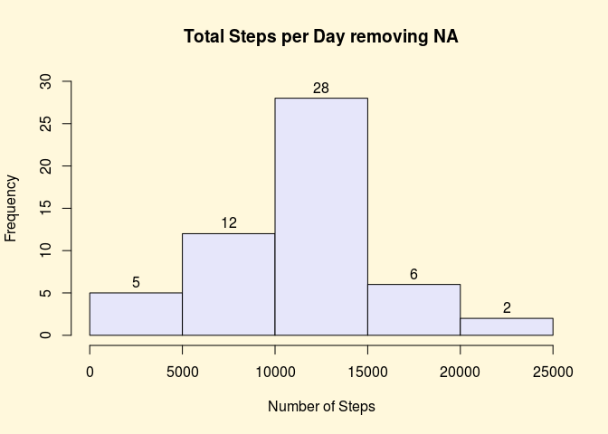
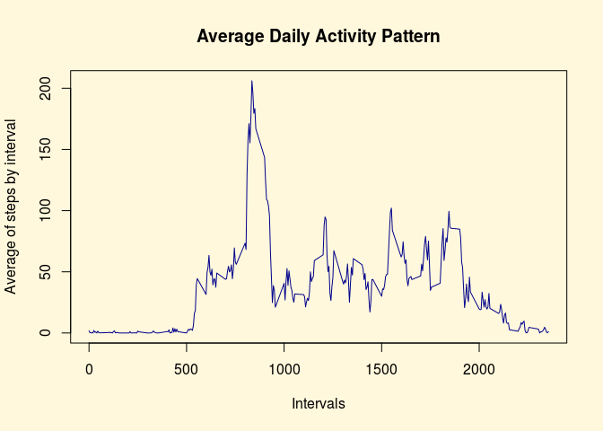
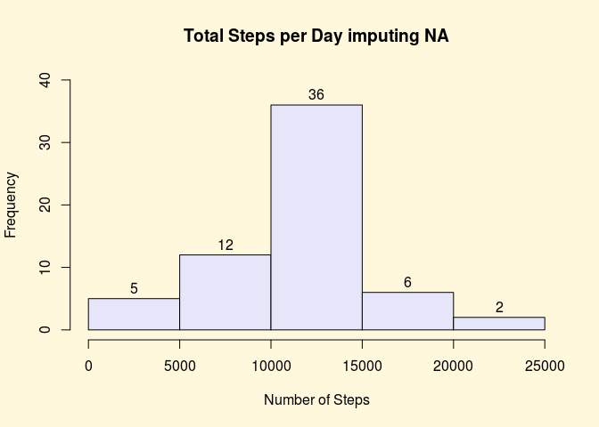
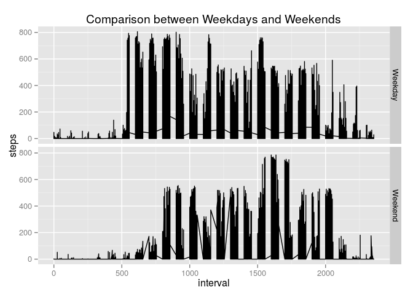

# PA1_template.Rmd
Carlos Rodriguez-Contreras  
August 16, 2015  
# Data Science Specialization
## Johns Hopkins University - Coursera
### Reproducible Research
### Assessment 1 
Carlos Rodriguez-Contreras  

This R Markdown document corresponds to the first peer assessment of the course Reproducible Research.  

## Loading and preprocessing the data  


```r
datasetURL <- "https://d396qusza40orc.cloudfront.net/repdata%2Fdata%2Factivity.zip"
download.file(datasetURL, destfile = "zippedFile.zip", method = "curl")

# Unzip the dataset into work directory:
unzip("zippedFile.zip")
list.files()
```

```
## [1] "activity.csv"     "PA1_template.Rmd" "zippedFile.zip"
```

```r
Activity.Monitoring.Data <- read.csv("activity.csv", header = TRUE, na.strings = "NA")
str(Activity.Monitoring.Data)
```

```
## 'data.frame':	17568 obs. of  3 variables:
##  $ steps   : int  NA NA NA NA NA NA NA NA NA NA ...
##  $ date    : Factor w/ 61 levels "2012-10-01","2012-10-02",..: 1 1 1 1 1 1 1 1 1 1 ...
##  $ interval: int  0 5 10 15 20 25 30 35 40 45 ...
```

```r
Activity.Monitoring.Data$date = as.Date(as.character(Activity.Monitoring.Data$date), format = "%Y-%m-%d")

# Eliminating NA values from whole dataset:
library(Hmisc)
```

```
## Loading required package: grid
## Loading required package: lattice
## Loading required package: survival
## Loading required package: Formula
## Loading required package: ggplot2
## 
## Attaching package: 'Hmisc'
## 
## The following objects are masked from 'package:base':
## 
##     format.pval, round.POSIXt, trunc.POSIXt, units
```

```r
AMDwoNA <- na.delete(Activity.Monitoring.Data)
head(AMDwoNA)
```

```
##     steps       date interval
## 289     0 2012-10-02        0
## 290     0 2012-10-02        5
## 291     0 2012-10-02       10
## 292     0 2012-10-02       15
## 293     0 2012-10-02       20
## 294     0 2012-10-02       25
```

## Mean total numbers of steps taken per day  

The dataframe *AMDwoNA* is splitted by date, then for each day the number of steps recorded in 5 min intervals are accumulated.


```r
daily <- split(AMDwoNA, AMDwoNA$date)
dailySteps <- lapply(daily, function(x) {sum(x$steps)} )
dailySteps <- as.numeric(dailySteps)
```

### Generation of the Histogram without Missing Values:


```r
opar <- par()
par(bg = "cornsilk")
hist(dailySteps, xlab = "Number of Steps", main = "Total Steps per Day removing NA", labels = TRUE, ylim = c(0, 30), col = "lavender")
```

 

### Computing the Mean and the Median of the steps without missing values:


```r
paste("The Mean of the total number of steps taken per day is:", round(mean(dailySteps), 2))
```

```
## [1] "The Mean of the total number of steps taken per day is: 10766.19"
```

```r
paste("The Median of the total number of steps taken per day is:", round(median(dailySteps), 2))
```

```
## [1] "The Median of the total number of steps taken per day is: 10765"
```

## Average daily activity pattern

The dataframe *AMDwoNA* is splitted by interval, then for each interval the mean of steps recorded are computed.


```r
AMDwoNA$interval <- as.factor(AMDwoNA$interval)
interval <- split(AMDwoNA, AMDwoNA$interval)
intervalSteps <- lapply(interval, function(x) {mean(x$steps)} )
intervalSteps <- as.numeric(intervalSteps)
interval <- as.numeric(levels(AMDwoNA$interval))
```

### Generation of the Time Series plot of intervals - average of steps:


```r
par(bg = "cornsilk")
plot(interval, intervalSteps, type = "l", main = "Average Daily Activity Pattern", xlab = "Intervals", ylab = "Average of steps by interval", col ="darkblue")
```

 

### Computing the interval with the maximum number of steps:


```r
newTable <- as.data.frame(cbind(interval, intervalSteps))
mostActiveInterval <- newTable[which(newTable$intervalSteps == max(newTable$intervalSteps)), ]
paste ("The most active interval is", mostActiveInterval$interval, "with", mostActiveInterval$intervalSteps)
```

```
## [1] "The most active interval is 835 with 206.169811320755"
```

## Imputing missing values

Identifying the NA (missing values) from the original data set *Activity.Monitoring.Data* computing the ammount of NA and impute them with the mean of the interval.


```r
AMDimputedNA <- Activity.Monitoring.Data
missingValues <- is.na(AMDimputedNA$steps)
paste("The total number of missing values is", sum(missingValues))
```

```
## [1] "The total number of missing values is 2304"
```

```r
AMDimputedNA[missingValues, ]$steps <- intervalSteps
```

### Generating a Histogram with NA filled in:


```r
daily2 <- split(AMDimputedNA, AMDimputedNA$date)
dailySteps2 <- lapply(daily2, function(x) {sum(x$steps)} )
dailySteps2 <- as.numeric(dailySteps2)

# Creating the histogram for Total Steps per Day:
opar <- par()
par(bg = "cornsilk")
hist(dailySteps2, xlab = "Number of Steps", main = "Total Steps per Day imputing NA", labels = TRUE, ylim = c(0, 40), col = "lavender")
```

 

### Computing the Mean and the Median of the steps with missing values:


```r
paste("The Mean of the total number of steps taken per day is:", round(mean(dailySteps2), 2))
```

```
## [1] "The Mean of the total number of steps taken per day is: 10766.19"
```

```r
paste("The Median of the total number of steps taken per day is:", round(median(dailySteps2), 2))
```

```
## [1] "The Median of the total number of steps taken per day is: 10766.19"
```

It is noticed that there is a little impact of imputing missing data, this is in part for being 10% approx. This also means that using the mean as imputation method is quite acceptable.

## Differences in activity patterns between weekdays and weekends

For this to be computed, it is used the *weekdays()* function, in this particular case, names of days are displayed in Spanish and so, the computations used special characters (UTF-8 set of characters). Anyway, the results must be correct.


```r
daysOfWeek <- as.list(weekdays(AMDimputedNA$date))
TypeOfDays <- lapply(daysOfWeek, function(x){
    if (x != "sábado" & x != "domingo") x <- "Weekday"
    else x <- "Weekend"
})

AMDimputedNA$type <- as.factor(as.character(TypeOfDays))
```

### Genaration of plots using ggplot2:


```r
library(ggplot2)
qplot(interval, steps, data = AMDimputedNA, geom = "line", facets = type ~ . , main = "Comparison between Weekdays and Weekends")
```

 

It is noticed that during Weekends the steps pattern is more uniform which means more people are involved in some kind of fitness activities.
